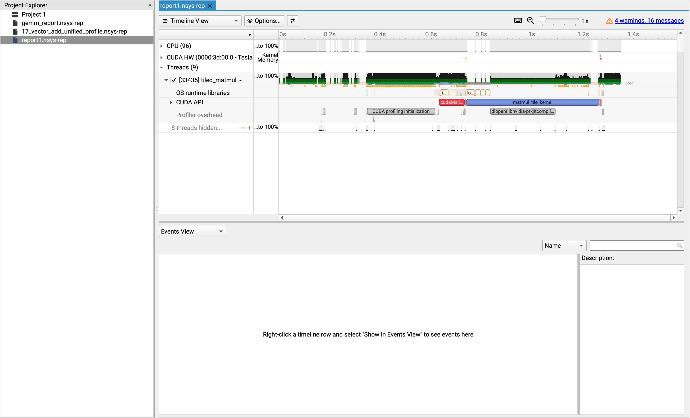

Nsight Systems
==========================

.. admonition:: Overview
   :class: Overview

    * **Tutorial:** 45 min

        **Objectives:**
            #. Understand the basics of Nsight Systems and how to use it for profiling applications.

Nsight Systems is a profiling tool for CUDA applications. It helps developers identify performance 
bottlenecks in their CUDA kernels and applications.

First, load the necessary modules.

..  code-block:: bash
    :linenos:

    module load gcc/10.3.0
    module load cuda/12.9.0

Then compile the matrix multiplication application with NVCC

..  code-block:: bash
    :linenos:

    cd /scratch/vp91/$USER/intro-to-profiling/code/nsys

    nvcc -O0 -g tiled_matmul_multikernel.cu -o tiled_matmul

* `-g` enables debugging information.
* `-O0` disables optimizations to make debugging easier.

Nsight Systems profiler
---------------------------------

Now run the program with Nsight Systems to check for performance bottlenecks

..  code-block:: bash
    :linenos:

    nsys profile --trace=cuda,nvtx,osrt --stats=true ./tiled_matmul

or submit the job script

..  code-block:: bash
    :linenos:

    cd /scratch/vp91/$USER/intro-to-profiling/job_scripts/nsys

    qsub 1_matmul.pbs

This will generate a report file with the extension `.nsys-rep`.

Viewing the report
---------------------------------

..  code-block:: bash
    :linenos:

    module load cuda/12.9.0

    nsys-ui report1.nsys-rep

On Gadi this will usualy result in an error due to missing display. To get around this, launch a `Virtual Desktop  <https://handson-with-gadi.readthedocs.io/en/latest/tutorial/are_desktop.html>`_ session on Gadi and run the above 
command in the terminal available on the Virtual Desktop. 

Once launched you can explore the performance data using the various views and analysis tools provided by Nsight Systems.

.. admonition:: Key Points
   :class: hint

    #. Nsight Systems is a powerful tool for profiling CUDA applications.
    #. It provides insights into kernel execution times, memory transfers, and other performance metrics.
    #. Using Nsight Systems can help identify performance bottlenecks and optimize CUDA applications.